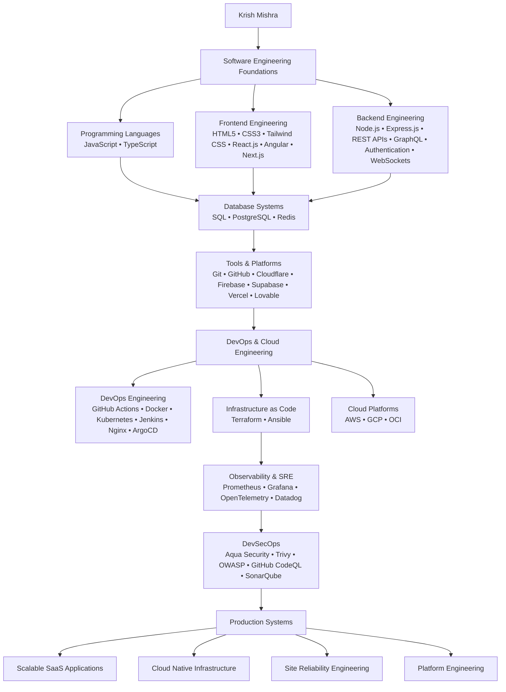

<h1 align="center">Krish Mishra</h1>


<!-- Typing SVG Animation -->
[;Fullstack+Developer;DevOps+%7C+Cloud+%7C+SRE+Focused+Engineer;Passionate+Learner+%7C+Problem+Solver;Open+Source+Contributor)](https://git.io/typing-svg)
---

<h1 align="center">About Me</h1>

 <h3 align="center">
Engineering Student @ RIT, Raipur
</h3>

<p align="center">
Fullstack Web Developer | DevOps | Cloud Computing & Site Reliability Engineering Enthusiast
<br>
Exploring DevOps, Cloud, DSA & Open Source
<br>
Love building real-world projects and learning new technologies
</p>

---

<h1 align="center">Tech Roles</h1>

<p align="center">
  <strong>FullStack Development</strong> | 
  <strong>DevOps Engineering</strong> | 
  <strong>Platform Engineering</strong> | 
  <strong>Cloud Engineering</strong> | 
  <strong>Site Reliability Engineering</strong>
</p>

---


<h1 align="center">Core Strengths</h1>

<div align="center">

```text
Frontend   ▰▰▰▰▰▰▰▱▱▱ 70%

Backend    ▰▰▰▰▰▰▰▰▰▱ 90%

DevOps     ▰▰▰▰▰▰▰▰▰▰ 95%

Cloud      ▰▰▰▰▰▰▱▱▱▱ 65%

SRE        ▰▰▰▰▰▰▰▱▱▱ 75%
```

</div>

---

<h1 align="center">Engineering Competencies</h1>




---

<h1 align="center">GitHub Stats</h1>

<p align="center">
  
</p>

---

<h1 align="center">Contribution Graph</h1>

<p align="center">
  
</p>

---

<h1 align="center">Skills & Tools</h1>

---

<h3 align="center">Programming Languages</h3>

<div align="center">

| JavaScript | TypeScript |
|:----------:|:----------:|
|  |  |

</div>

---

<h3 align="center">Frontend</h3>

<div align="center">

| HTML | CSS | Tailwind CSS | React | Angular | Next.js |
|:----:|:---:|:------------:|:-----:|:-------:|:-------:|
|  |  |  |  |  |  |

</div>

---

<h3 align="center">Backend</h3>

<div align="center">

| Node.js | Express.js | REST APIs | GraphQL |
|:-------:|:----------:|:---------:|:-------:|
|  |  |  |  |

</div>

---

<h3 align="center">Databases</h3>

<div align="center">

| SQL | PostgreSQL | Redis |
|:---:|:----------:|:-----:|
|  |  |  |

</div>

---

<h3 align="center">Tools</h3>

<div align="center">

| Cloudflare | Supabase | Firebase | Vercel | Git | GitHub |
|:----------:|:--------:|:--------:|:------:|:---:|:------:|
|  |  |  |  |  |  |

</div>

---

<h3 align="center">DevOps, CI-CD & IaC</h3>

<div align="center">

| Docker | Kubernetes | Nginx | GitHub Actions | Jenkins | ArgoCD | Terraform | Ansible |
|:------:|:----------:|:-----:|:--------------:|:-------:|:------:|:---------:|:-------:|
|  |  |  |  |  |  |  |  |

</div>

<h3 align="center">Monitoring, Observability & SRE</h3>

<div align="center">

| OpenTelemetry | Prometheus | Grafana | Datadog |
|:-------------:|:----------:|:-------:|:-------:|
|  |  |  |  |

</div>

<h3 align="center">Linux & DevSecOps</h3>

<div align="center">

| Linux | Trivy | SonarQube | OWASP | GitHub CodeQL |
|:-----:|:-----:|:---------:|:-----:|:-------------:|
|  |  |  |  |  |

</div>

---

<h3 align="center">Cloud Platforms</h3>

<div align="center">

| AWS | GCP | OCI |
|:---:|:---:|:---:|
|  |  |  |

</div>

---

<h3 align="center">Data Analysis & Visualization</h3>

<div align="center">

| D3.js | Chart.js |
|:-----:|:--------:|
|  |  |

</div>

---

<h1 align="center">Connect & Collaborate</h1>

<div align="center">

| <a href="https://me.developers.google.com/u/KrrishGLE">Google Developer Profile</a> | <a href="https://github.com/KrrishSR4">GitHub</a> |
|:------------------------------------------------------------------------------------:|:--------------------------------------------------:|
|  |  |

</div>

---


